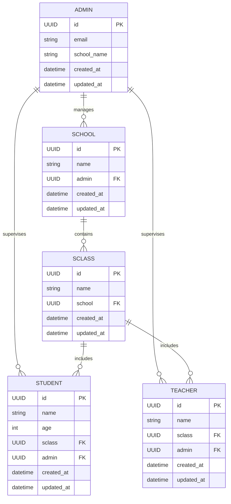

<div align="center">
  <h1>🎓 OrgSchool</h1>
  <h3><em>Organize, Simplify, Prosper</em></h3>
  <p><strong>A comprehensive Student Management System for modern educational institutions</strong></p>
  
  [](https://github.com/WalaEddine01/OrgSchool-project-nexus)
  [](https://python.org)
  [](https://djangoproject.com)
  [](https://www.django-rest-framework.org/)
  [](https://mysql.com)

  <p>
    <a href="">🌐 Live Demo (not ready)</a> •
    <a href="#-getting-started">🚀 Quick Start</a> •
    <a href="#-api-documentation">📖 API Docs</a> •
  </p>

  <p>
    <a href="https://github.com/WalaEddine01">👨‍💻 GitHub</a> •
    <a href="https://twitter.com/w1laaeddine">🐦 Twitter</a> •
    <a href="https://www.linkedin.com/in/wala-eddine-boulebbina">💼 LinkedIn</a> •
    <a href="https://walaeddine.tech">📄 portfolio</a>
  </p>
</div>

---

## 📋 Overview

OrgSchool is a comprehensive **Student Management System (SMS)** built with Django and Django REST Framework. It streamlines the organization and administration of educational institutions, providing a robust platform for managing students, teachers, classes, and administrative tasks efficiently.

---

## 📑 Table of Contents
- [📋 Overview](#-overview)
- [✨ Features](#-features)
- [🏗️ Architecture](#️-architecture)
- [🛠️ Tech Stack](#️-tech-stack)
- [🚀 Getting Started](#-getting-started)
- [💻 Usage](#-usage)
- [📖 API Documentation](#-api-documentation)
- [🧪 Testing](#-testing)
- [🤝 Contributing](#-contributing)
- [👥 Contributors](#-contributors)
- [🆘 Support](#-support)
- [📄 License](#-license)

---

## ✨ Features

### 🔐 **Security & Authentication**
- Secure user authentication (Django sessions)
- Password hashing (Django standards)
- Role-based access control for admins
- Data validation and protection

### 📊 **Management Capabilities**
- Student, teacher, class, and school management
- CRUD operations via web and REST API
- Dashboard with real-time stats

### 🎨 **User Experience**
- Responsive, modern UI (Bootstrap 5, crispy forms)
- Interactive dashboard and quick actions

### 🔌 **API & Integration**
- RESTful API (Django REST Framework)
- Swagger documentation (`drf-yasg`)
- JSON data exchange
- CORS support

---

## 🏗️ Architecture

OrgSchool uses Django’s layered architecture:

```
┌─────────────────────────────────┐
│     Presentation Layer          │
│   (HTML, CSS, JS, Templates)   │
├─────────────────────────────────┤
│     Application Layer           │
│   (Django Views, DRF ViewSets)  │
├─────────────────────────────────┤
│     Business Logic Layer        │
│      (Models, Serializers)      │
├─────────────────────────────────┤
│     Data Access Layer           │
│    (ORM, MySQL Database)        │
└─────────────────────────────────┘
```

---

## 🛠️ Tech Stack

### **Backend**
- **Python 3.10+**
- **Django 4.2+**
- **Django REST Framework (DRF)**
- **MySQL 8.0+**
- **drf-yasg** (Swagger API docs)
- **django-crispy-forms**
- **django-widget-tweaks**
- **python-decouple** (env vars)

### **Frontend**
- **HTML5, CSS3, Bootstrap 5**
- **JavaScript (ES6+)**

### **Dev & Deployment**
- **Git**
- **Virtual Environment**
- **Docker (optional)**

---

## 🚀 Getting Started

### 📋 Prerequisites
- Python 3.10+
- MySQL 8.0+
- pip
- Git

### ⚡ Quick Setup

#### 1. **Clone the Repository**
```bash
git clone https://github.com/WalaEddine01/OrgSchool-project-nexus.git
cd OrgSchool-project-nexus
```

#### 2. **Set Up Virtual Environment**
```bash
python3 -m venv .venv
source .venv/bin/activate  # On Linux/Mac
# .venv\Scripts\activate  # On Windows
```

#### 3. **Install Dependencies**
```bash
pip install -r requirements.txt
```

#### 4. **Configure MySQL Database**
```bash
# Start MySQL service
sudo systemctl start mysql  # Linux
# brew services start mysql # Mac
# net start mysql          # Windows

# Create database and user
sudo mysql < setup/setup_mysql_dev.sql
```

#### 5. **Set Environment Variables**
Edit `.env` file (see `.env.example`):
```
SECRET_KEY=your-secret-key
DEBUG=True
ALLOWED_HOSTS=localhost,127.0.0.1
DB_NAME=org_db
DB_USER=org_user
DB_PASSWORD=org_pass
DB_HOST=localhost
DB_PORT=3306
```

#### 6. **Run Migrations & Create Superuser**
```bash
python manage.py makemigrations
python manage.py migrate
python manage.py createsuperuser
```

#### 7. **Start the Application**
```bash
python manage.py runserver
```
*Access at: [http://localhost:8000](http://localhost:8000)*

---

## 💻 Usage

- Register and log in as an admin
- Create and manage schools, classes, students, and teachers
- Use the dashboard for quick stats and actions
- Access REST API endpoints for integration

---

## 📖 API Documentation

OrgSchool provides a comprehensive RESTful API:

- **Interactive Swagger Docs:** [http://localhost:8000/api/v1/doc/](http://localhost:8000/api/v1/doc/)
- **ReDoc:** [http://localhost:8000/api/v1/redoc/](http://localhost:8000/api/v1/redoc/)
- **API Docs:** [API_DOC.md](API_DOC.md)

### Quick API Examples

**Get All Schools:**
```bash
curl http://localhost:8000/api/v1/schools/
```

**Create New Student:**
```bash
curl -X POST http://localhost:8000/api/v1/students/ \
  -H "Content-Type: application/json" \
  -d '{"name": "John Doe", "age": 15, "sclass": "<class_id>", "admin": "<admin_id>"}'
```

**Get All Students in a Class:**
```bash
curl http://localhost:8000/api/v1/sclasses/<class_id>/students/
```

---

## 🗂️ Entity Relationship Diagram (ERD)

Paste this Mermaid code in [mermaid.live](https://mermaid.live/) for a visual ERD:



---

## 🧪 Testing

Run the test suite:
```bash
python manage.py test
```

---

## 🤝 Contributing

We welcome contributions! Please:
- File issues with clear descriptions
- Submit feature requests
- Open pull requests with tests and documentation
- Follow PEP 8 and Django best practices

---

## 👥 Contributors

<div align="center">
  <table>
    <tr>
      <td align="center">
        <a href="https://github.com/WalaEddine01">
          
          <br />
          <sub><b>Wala Eddine Boulebbina</b></sub>
        </a>
        <br />
        <sub>🏗️ Project Creator & Lead Developer</sub>
        <br />
        <a href="https://github.com/WalaEddine01" title="GitHub">🐙</a>
        <a href="https://linkedin.com/in/wala-eddine-boulebbina" title="LinkedIn">💼</a>
        <a href="https://twitter.com/w1laaeddine" title="Twitter">🐦</a>
      </td>
    </tr>
  </table>
</div>

---

## 🆘 Support

Need help? Contact:
- **Email:** [walaaeddine33@gmail.com](mailto:walaaeddine33@gmail.com)
- **GitHub Discussions:** [Project Discussions](https://github.com/WalaEddine01/OrgSchool-project-nexus/discussions)
- **Issues:** [Report a Bug](https://github.com/WalaEddine01/OrgSchool-project-nexus/issues)

---

## 📄 License

This project is licensed under the **MIT License** - see the [LICENSE](LICENSE) file for details.

---

<div align="center">
  <h3>🌟 Star this repository if you found it helpful!</h3>
  <p>
    <a href="https://github.com/WalaEddine01/OrgSchool-project-nexus/stargazers">
      
    </a>
    <a href="https://github.com/WalaEddine01/OrgSchool-project-nexus/network/members">
      
    </a>
  </p>
  <p><em>Made with ❤️ by <a href="https://github.com/WalaEddine01">Wala Eddine Boulebbina</a></em></p>
  <sub>🚀 Building the future of education management, one commit at a time.</sub>
</div>

